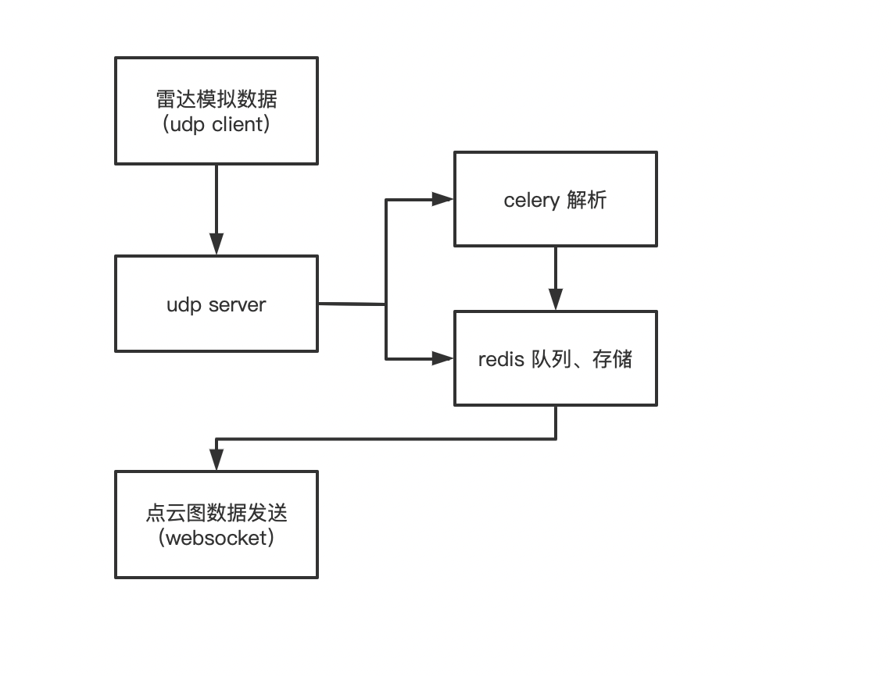

- lidar 工程化设计方案
  - 工程化设计图



- 介绍

  - 服务共包括 4 个子服务，分别为：雷达数据模拟发送、雷达数据接收、l雷达数据处理、点云图数据发送。
  - 流程介绍
    - 雷达数据模拟：循环从原始文件中读取数据，通过 udp clinet 发送至雷达数据接收。
    - 雷达数据接收：通过 udp server 持续接收雷达数据，根据 udp client 的 ip 进行区分，每个对应 ip 连续接收 180 条数据，作为点云图一桢，存储至 redis
      队列。
    - 雷达数据处理：celery 持续解析雷达数据，将解析结果存储至 redis
    - 点云图发送：当有 websocket client 连接时，持续从 redis 点云图数据，通过 websocket server 发送至 websocket client 。

- 如何开发

  - 环境：

    - ubuntu、docker、docker-compose、>=python3.8

  - 本地部署（基于 ubuntu）

    ```shell
    # 添加环境变量 redis 密码，password 为要设置的密码
    export OPENV2X_REDIS_ROOT=passowrd
    git clone https://github.com/open-v2x/lidar.git
    cd lidar
    bash start.sh
    ```

  - 测试服务是否启动，连接 websocket server 是否收到数据（参考 project/websocket_client.py 文件，修改 websocker url ，将 ip
    改成部署服务器 ip ）。

  - 代码 format 和 格式检查

    ```shell
    tox -e pep8-format
    tox -e pep8
    ```

  - 文件 format

    ```shell
    dprint fmt
    ```
